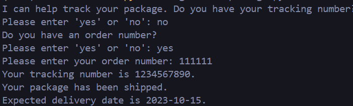
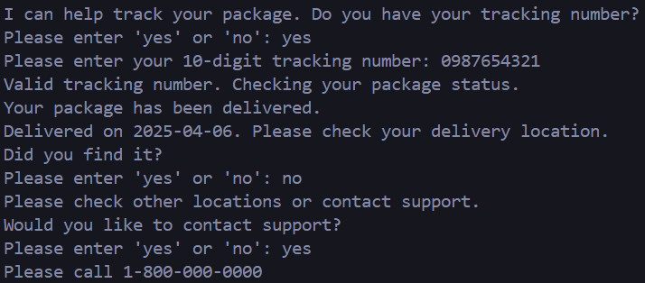
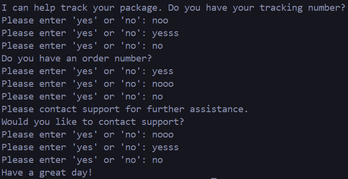
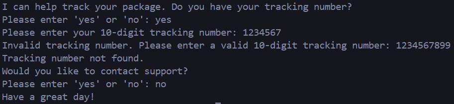
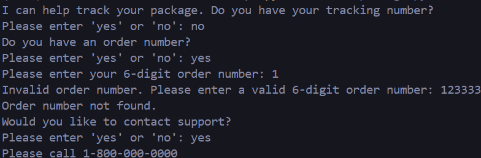

# Track a Lost Package
### Setup/installation
* Requirements
    * Python
        * re package `pip install re`
* Setup (Run the following commands in the terminal)
    * Clone the repository `git clone https://github.com/Shashhank12/TrackPackage.git`
    * Go into the directory `cd TrackPackage`
    * Run the chatbot using `python trackpackage.py` or `python3 trackpackage.py`

### Explanation
If a user loses a package, they often have a tracking number. If they don't have a tracking number, they should be able to retrieve their tracking number based on their order number. Using this approach, we can request the tracking number or order number to help user identify. Using either the tracking number or order number, we can retrieve the tracking information. Based on the tracking status, we can provide appropriate responses. If a package is shipped, we can provide estimated delivery date. If a package is out for delivery, we can give a delivery time. If a package is delivered, we can ask the user to check and provide the date it was delivered. From there, the user can provide a response on whether or not the package was found. If it was, then the user is all good. If the user did not get an intended result, we provide customer support to further assist them. Additionally, this program handles mis-inputs that the user may provide such as incorrect inputs or typos. It will prompt the user to try again if its an invalid response. To simulate the package tracking, this code uses two dictionaries. One dictionary stores the tracking number and its corresponding status. This status can be searched to get information about the package status. The other dictionary stores the order number and its corresponding tracking number. It makes it possible to retrieve the tracking number from the order number.

### Example
* Example 1: User tracks a package using order number.

* Example 2: User tracks a package and contacts customer support after not finding the package.

* Example 3: Examples of mis-inputs. (Error handling)
 
* Example 4: User types an invalid tracking number. (Error handling)

* Example 5: User types an invalid order number. (Error handling)

